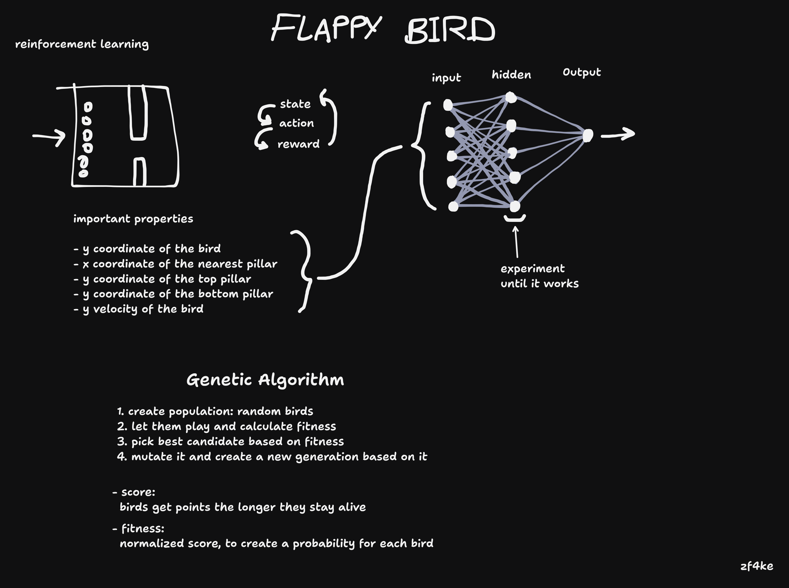

# Neuroevolution Flappy Bird

I use a JavaScript neural network library and a genetic algorithm to train an agent to play Flappy Bird.

# Whiteboard

# Where I learned this

[The Coding Train - Youtube Video](https://www.youtube.com/watch?v=c6y21FkaUqw)
